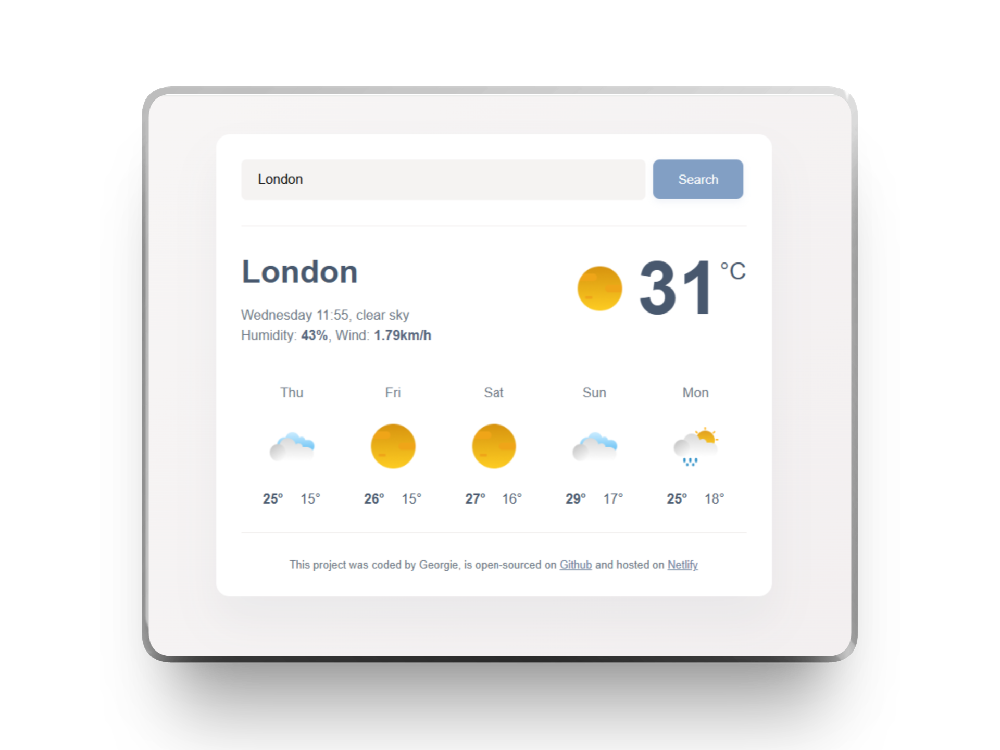

<div align="center">

<h1>Weather Search Application</h1>




**A sleek weather app delivering real-time forecasts for any city, worldwide.**

</div>

This project is a weather search application which displays live weather updates for the city that the user has typed into the search function. By connecting to an external API, real time information about the current temperature and weather conditions, as well as a 5 day weather forecast, are displayed to the user.
The project is deployed on Netlify and can be accessed following the link below.

<div align="center">

[](https://weathersearch28.netlify.app/)

</div>

## Features

- 🔍 Search by city
- 🌡️ Current temperature
- ☀️ Current weather conditions
- 📅 5-day weather forecast

## Technologies Used

- HTML 5
- CSS 3
- Javascript
- Axios
- Netlify

## Installation

### Prerequisites

- A code editor (e.g. [VS Code](https://code.visualstudio.com/))
- A modern web browser (e.g. Chrome, Firefox, Edge)
- [Git](https://git-scm.com/) installed, to clone the repository
- A GitHub account
- A free weather API key ([sign up here](https://www.shecodes.io/learn/apis/weather))

### 1. Clone the repository

```
git clone <repository_url>
cd Weather-Search-Application
```

### 2. Add your API key

- Sign up for your free API key ([sign up here](https://www.shecodes.io/learn/apis/weather))
- Open app.js and paste your key into the `apiKey` variable

> **Note:** For the live deployment, the API key is injected via a Netlify environment variable at build time — the placeholder in `app.js` is intentional and not a bug. If running the project locally, replace `API_KEY_PLACEHOLDER` with your own key.

### 3. Open the project

Open `index.html` in your browser (double-click the file), or open `index.html` in VS Code and click 'Go Live'.

<br>

## Deploying the project on netlify

The project is hosted on Netlify, connected via GitHub so any changes pushed to your repository automatically redeploy.

1. Push your project to your remote Github repository.

2. Log into [Netlify](https://www.netlify.com/) with your Github account

3. Click on **Create New Site from Git**

4. Authorise your Github account for continuous deployment and select your repository

5. Add your API key as an environment variable:

- **Site Configuration** -> **Environment Variables** -> **Add a variable**
- Name: `API_KEY`, Value: your real API key

6. Set the build command to inject your key at deploy time:

- **Site Configuration** -> **Build & deploy** --> **Build Settings**
- Build command: `sed -i "s/API_KEY_PLACEHOLDER/$API_KEY/g" app.js`
- Publish directory: `.`

7. Click **Deploy Site** - this will push your application online

<br>

## API Reference

The project uses 2 external APIs.

- The **Current Weather API** provides weather data for the current day and can be accessed here:
  https://api.shecodes.io/weather/v1/current?query={query}&key={key}

- The **Forecast Weather API** provides data for up to 7 subsequent days and can be accessed here: https://api.shecodes.io/weather/v1/forecast?query={query}&key={key}

  <br>

**Both endpoints accept the same parameters:**

| Parameters |          |                                      |
| ---------- | -------- | ------------------------------------ |
| query      | required | The name of a city (example: Lisbon) |
| key        | required | Your API key                         |
| units      | optional | Either metric or imperial            |
